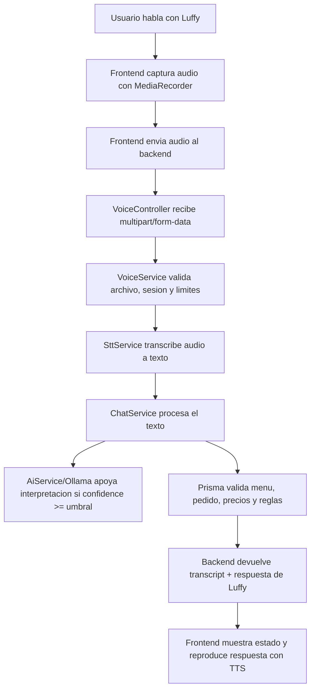

# Arquitectura de voz real y STT para Luffy

Fecha: 2026-06-08

## Alcance del documento

Este documento define la fase final de voz para el sistema "Menu por Voz con IA
para Restaurantes". No implementa codigo ni cambia el flujo actual. Su objetivo
es fijar una arquitectura tecnica para reemplazar gradualmente el reconocimiento
inestable del navegador por una capa Speech-to-Text local o controlada por el
backend.

Contexto validado en el proyecto:

- Backend actual: NestJS, Prisma, Supabase PostgreSQL, modulos `session`,
  `menu`, `order`, `chat` y `ai`.
- Frontend actual: Next.js con una pantalla voice-first en `app/page.tsx`.
- Flujo funcional actual: texto y acciones rapidas envian mensajes a
  `POST /chat/message`.
- Voz actual: `SpeechRecognition` del navegador para entrada y
  `speechSynthesis` para salida.
- IA actual: Ollama con `qwen2.5:3b` interpreta mensajes como apoyo, pero el
  backend conserva la autoridad sobre menu, pedido, precios, totales y
  confirmacion.
- Documentacion anterior: ya identifica que el reconocimiento definitivo con
  Whisper o motor local estaba fuera del alcance del avance previo y que el
  reconocimiento del navegador era una limitacion. La documentacion antigua
  menciona "Leo"; el codigo actual y esta fase usan "Luffy".

## 1. Diagnostico del problema actual

### Limitaciones de `SpeechRecognition` del navegador

El problema principal no esta en el flujo de pedido ni en Ollama. Esta en la
capa que convierte audio en texto.

El frontend actual usa `SpeechRecognition` o `webkitSpeechRecognition`. Esa API
presenta tres problemas para este producto:

1. No es una base suficientemente estable para un flujo accesible principal.
   MDN la marca como una funcionalidad de disponibilidad limitada porque no
   funciona en algunos navegadores ampliamente usados.
2. En navegadores como Chrome, el reconocimiento puede depender de un motor
   remoto del proveedor del navegador. Si ese servicio falla, se bloquea, no
   tiene conectividad o el navegador decide cortar la sesion, el producto recibe
   errores como `network`.
3. La aplicacion no controla el motor de reconocimiento, el modelo, la latencia,
   el manejo offline, los idiomas reales instalados ni la politica de privacidad
   del procesamiento de audio.

Para una persona con discapacidad visual o baja vision, un error `network` en el
microfono no es un detalle menor. Rompe el canal principal de interaccion. Los
botones grandes y el modo texto sirven como emergencia y como herramienta de
prueba, pero no deben ser el flujo principal del MVP final.

### Por que Ollama no soluciona el microfono

Ollama y `qwen2.5:3b` trabajan sobre texto. En el backend actual, `AiService`
recibe un mensaje ya escrito o ya transcrito y devuelve una intencion
estructurada con confianza. Esa capa puede ayudar a interpretar:

- "quiero una hamburguesa";
- "quita la gaseosa";
- "repiteme mi pedido";
- "confirmo mi pedido".

Pero Ollama no escucha el microfono, no recibe audio bruto, no convierte voz en
texto y no reemplaza un motor STT. Si el navegador no logra producir un
transcript, Ollama no tiene una entrada confiable que interpretar.

La separacion correcta es:

- STT: audio -> texto.
- Ollama: texto -> intencion estructurada.
- `ChatService`: intencion + reglas + base de datos -> respuesta y mutaciones
  validas.
- TTS: respuesta de texto -> voz para el usuario.

### Por que se necesita una capa STT

El sistema necesita una capa Speech-to-Text propia porque el producto es
voice-first y accesible. La capa STT debe estar fuera del navegador para que el
equipo controle:

- motor de transcripcion;
- modelo y tamano;
- idioma;
- limites de audio;
- logs tecnicos;
- errores recuperables;
- privacidad;
- pruebas reproducibles;
- migracion futura a otro proveedor sin reescribir el flujo conversacional.

La capa STT no debe ejecutar reglas de negocio. Solo debe devolver texto y
metadatos tecnicos.

## 2. Arquitectura propuesta

La arquitectura objetivo mantiene el backend como fuente de verdad y mueve la
entrada de voz a un flujo controlado por el servidor.



### Flujo recomendado

1. El usuario toca el area principal o activa el control de voz.
2. El frontend pide permiso de microfono con `getUserMedia`.
3. El frontend graba audio con `MediaRecorder`.
4. Al terminar la frase, el frontend genera un `Blob` de audio.
5. El frontend envia el audio al backend usando `multipart/form-data`.
6. El backend valida tamano, tipo de archivo, duracion maxima y sesion.
7. `SttService` transcribe el audio a texto.
8. `VoiceService` entrega el texto a `ChatService`.
9. `ChatService` usa reglas actuales y apoyo de Ollama cuando la confianza sea
   suficiente.
10. El backend devuelve respuesta de chat, texto transcrito y metadatos.
11. El frontend reproduce `assistantMessage` con `speechSynthesis`.

### Principios de diseno

- El frontend captura audio, pero no interpreta pedidos.
- El frontend no calcula precios ni totales.
- El backend no debe confiar en texto, precio, producto ni cantidad enviados por
  el cliente sin validar contra la base de datos.
- STT no decide acciones de pedido.
- Ollama no ejecuta acciones de pedido.
- `ChatService` sigue siendo la capa de politica conversacional.
- Prisma y los servicios de negocio siguen siendo la autoridad final.
- El flujo actual con Web Speech API debe conservarse temporalmente como
  fallback, no como flujo principal final.

## 3. Nuevos modulos propuestos

### Backend

#### `VoiceModule`

Modulo NestJS para agrupar los componentes de voz.

Responsabilidades:

- importar dependencias necesarias para voz;
- exponer `VoiceController`;
- registrar `VoiceService` y `SttService`;
- importar `ChatModule` cuando `POST /voice/message` deba entregar el transcript
  al flujo conversacional.

Convencion futura sugerida:

```text
backend/src/modules/voice/
  voice.module.ts
  voice.controller.ts
  voice.service.ts
  stt.service.ts
  dto/
    voice-message-response.dto.ts
    transcribe-audio-response.dto.ts
```

#### `VoiceController`

Controlador delgado. No debe transcribir directamente ni tocar Prisma.

Responsabilidades:

- recibir `POST /voice/transcribe`;
- recibir `POST /voice/message`;
- aplicar interceptores de archivo cuando se implemente carga multipart;
- delegar a `VoiceService`;
- devolver DTOs claros.

#### `VoiceService`

Orquestador de voz.

Responsabilidades:

- validar que el audio exista;
- aplicar limites de tamano y duracion;
- normalizar metadatos tecnicos;
- llamar a `SttService`;
- decidir si se devuelve solo transcripcion o si se procesa como mensaje;
- llamar a `ChatService.handleMessage` para `POST /voice/message`;
- no duplicar la logica de pedidos que ya vive en `ChatService` y
  `OrderService`.

#### `SttService`

Servicio tecnico de transcripcion.

Responsabilidades:

- recibir audio temporal o buffer validado;
- convertir el formato si el motor STT lo exige;
- ejecutar el motor STT local o llamar al servicio STT local;
- devolver transcript limpio y metadatos;
- manejar timeouts;
- mapear errores tecnicos a errores entendibles por `VoiceService`;
- borrar archivos temporales.

Interfaz conceptual:

```text
transcribe(input) -> {
  transcript: string;
  language?: string;
  durationMs?: number;
  engine: "whisper.cpp" | "faster-whisper" | "openai-whisper-local";
  confidence?: number;
}
```

### Frontend

#### Servicio de grabacion de audio

Crear una capa aislada para no seguir creciendo `app/page.tsx`.

Responsabilidades:

- pedir permiso de microfono;
- crear y controlar `MediaRecorder`;
- negociar `mimeType` soportado;
- acumular chunks de audio;
- detener grabacion por accion del usuario, silencio o duracion maxima;
- devolver un `Blob` listo para enviar.

Ruta futura sugerida:

```text
frontend/lib/voice/audio-recorder.ts
frontend/lib/voice/voice-api.ts
```

#### Flujo de envio de audio

El frontend debe enviar `FormData`, no JSON:

- campo `audio`: archivo de audio;
- campo `sessionId`: sesion activa para `POST /voice/message`;
- campo `language`: valor sugerido, por ejemplo `es-PE` o `es`;
- campo opcional `clientMimeType`: diagnostico.

#### Estados de voz

Los estados actuales deben evolucionar para separar grabacion, envio,
transcripcion y respuesta:

- `idle`: listo para escuchar;
- `requestingPermission`: pidiendo permiso de microfono;
- `recording`: capturando audio local;
- `uploading`: enviando audio al backend;
- `transcribing`: backend/STT procesando audio;
- `processing`: `ChatService` procesando el texto;
- `speaking`: Luffy esta hablando;
- `error`: fallo recuperable.

Esta separacion importa para accesibilidad. El usuario debe escuchar mensajes
cortos y concretos, por ejemplo:

- "Te escucho.";
- "Estoy procesando tu voz.";
- "No pude entender el audio. Intentemos otra vez.";
- "El microfono no tiene permiso.";

#### Fallback temporal

El fallback debe existir mientras se migra:

- flujo principal futuro: `MediaRecorder` -> backend STT;
- fallback temporal: Web Speech API actual;
- emergencia tecnica: modo prueba por texto y botones rapidos.

El fallback no debe ocultar errores del nuevo flujo. Si STT falla, se debe
informar al usuario de forma audible y registrar el error tecnico para debug.

## 4. Endpoints propuestos

### `POST /voice/transcribe`

Endpoint tecnico para probar y diagnosticar STT. No debe modificar pedidos.

Uso principal:

- validar carga de audio;
- medir latencia de transcripcion;
- comparar motores STT;
- depurar idioma y formato de audio;
- probar sin tocar `ChatService`.

Request:

```text
Content-Type: multipart/form-data

audio: File
language?: string
clientMimeType?: string
```

Response:

```json
{
  "transcript": "quiero una hamburguesa clasica",
  "language": "es",
  "engine": "whisper.cpp",
  "durationMs": 1840
}
```

Regla critica: este endpoint solo transcribe. No agrega productos, no confirma
pedidos y no escribe eventos de pedido.

### `POST /voice/message`

Endpoint principal para el usuario final por voz.

Uso principal:

- recibir audio;
- transcribirlo;
- entregar el texto a `ChatService`;
- devolver la respuesta de Luffy.

Request:

```text
Content-Type: multipart/form-data

sessionId: string
audio: File
language?: string
clientMimeType?: string
```

Response recomendada:

```json
{
  "transcript": "repiteme mi pedido",
  "chat": {
    "sessionId": "uuid",
    "orderId": "uuid",
    "intent": "ORDER_SUMMARY",
    "assistantMessage": "Tu pedido actual tiene..."
  },
  "stt": {
    "engine": "whisper.cpp",
    "durationMs": 1840,
    "language": "es"
  }
}
```

Regla critica: este endpoint no debe reimplementar reglas de pedido. Debe llamar
a `ChatService.handleMessage({ sessionId, message: transcript })`.

## 5. Estrategia de implementacion por fases

### Fase 1: crear documentacion y estructura

Objetivo:

- documentar arquitectura;
- acordar endpoints;
- definir contratos;
- no tocar comportamiento actual.

Resultado esperado:

- este documento;
- decision clara de motor STT inicial;
- backlog tecnico dividido por fases.

### Fase 2: backend recibe audio sin transcribir todavia

Objetivo:

- crear `VoiceModule`, `VoiceController`, `VoiceService` y `SttService`;
- agregar `POST /voice/transcribe`;
- aceptar `multipart/form-data`;
- validar archivo, tamano y tipo;
- devolver una respuesta temporal controlada, por ejemplo
  `STT_NOT_IMPLEMENTED`.

Reglas:

- no conectar aun con `ChatService`;
- no agregar motor STT todavia;
- no eliminar Web Speech API;
- no tocar base de datos.

### Fase 3: frontend graba audio con `MediaRecorder` y lo envia

Objetivo:

- crear servicio de grabacion;
- grabar audio real desde navegador;
- enviar audio a `POST /voice/transcribe`;
- mostrar y leer errores de forma accesible;
- mantener Web Speech API como fallback.

Reglas:

- no hacer que el nuevo flujo sea obligatorio hasta medir estabilidad;
- no eliminar botones de emergencia;
- no enviar precios, productos calculados ni totales desde frontend.

### Fase 4: integrar STT local

Objetivo:

- instalar y ejecutar el motor STT elegido;
- convertir audio si es necesario;
- transcribir audio real;
- medir latencia con audios cortos de 2 a 8 segundos;
- registrar errores tecnicos sin exponer rutas internas al usuario.

Primeras pruebas recomendadas:

- "leer carta";
- "que bebidas hay";
- "quiero una hamburguesa";
- "repiteme mi pedido";
- "confirmo mi pedido".

### Fase 5: conectar STT con `ChatService` y Ollama

Objetivo:

- implementar `POST /voice/message`;
- pasar el transcript a `ChatService`;
- conservar el apoyo de Ollama con umbral de confianza;
- seguir validando productos, cantidades y confirmacion desde backend;
- devolver `transcript`, `assistantMessage`, `intent` y metadatos STT.

Reglas:

- `SttService` no decide intenciones;
- Ollama no confirma pedidos por si solo;
- `ChatService` mantiene la proteccion contra confirmacion accidental;
- Prisma sigue siendo la fuente de verdad.

### Fase 6: pulir TTS y experiencia accesible

Objetivo:

- mejorar mensajes hablados;
- reducir tiempos muertos;
- evitar que Luffy escuche mientras Luffy habla;
- manejar silencio y frases incompletas;
- repetir el transcript cuando haya baja confianza o error;
- asegurar confirmacion verbal antes de cerrar un pedido.

Mejoras esperadas:

- mensajes cortos de estado;
- timeouts comprensibles;
- reintento por voz;
- fallback audible;
- historial tecnico visible solo en modo prueba.

## 6. Opciones tecnicas para STT

Hardware objetivo informado:

- CPU: Intel i5 de 12va generacion.
- RAM: 16 GB.
- GPU: RTX 3050 laptop con 4 GB VRAM.
- Sistema operativo de trabajo: Windows.

### Opcion A: Whisper local con implementacion original de OpenAI

Ventajas:

- implementacion oficial de referencia;
- facil de entender conceptualmente;
- modelos multilingues adecuados para espanol;
- buena base para comparar calidad.

Desventajas:

- entorno Python y PyTorch pesado;
- puede requerir FFmpeg en el sistema;
- mayor consumo de memoria que alternativas optimizadas;
- GPU limitada por 4 GB VRAM;
- `medium`, `large` y `turbo` no son buena primera opcion para esta laptop.

Lectura para este hardware:

- `base` y `small` son los candidatos realistas.
- `medium` ronda un requerimiento mayor al margen seguro de 4 GB.
- `large` y `turbo` quedan fuera como primera implementacion local en esta GPU.

### Opcion B: `faster-whisper`

Ventajas:

- reimplementacion optimizada con CTranslate2;
- puede usar cuantizacion INT8;
- mejor rendimiento/memoria que la implementacion original en muchos casos;
- no requiere instalar FFmpeg del sistema porque usa PyAV con librerias FFmpeg
  empaquetadas;
- permite CPU o GPU.

Desventajas:

- sigue siendo un servicio Python;
- GPU en Windows puede exigir cuadrar CUDA, cuBLAS y cuDNN;
- la RTX 3050 laptop de 4 GB deja poco margen para modelos grandes;
- puede introducir complejidad operativa antes de que el flujo de audio este
  probado.

Lectura para este hardware:

- buena opcion si se acepta un microservicio Python local;
- probar primero `base` o `small` con INT8;
- evitar `large-v3` como primera meta;
- usar GPU solo despues de validar instalacion CUDA estable.

### Opcion C: `whisper.cpp`

Ventajas:

- implementacion C/C++ ligera;
- soporta CPU-only;
- soporta cuantizacion;
- soporta Windows;
- tiene soporte para NVIDIA GPU, Vulkan y otras aceleraciones;
- puede ejecutarse como proceso local o servidor local;
- encaja con un MVP local y controlado.

Desventajas:

- requiere compilar o descargar binarios confiables;
- el backend debera manejar conversion de audio si el input llega como
  `audio/webm` u otro formato no aceptado directamente;
- la integracion por proceso debe tener timeouts y limpieza de archivos;
- la calidad y latencia dependen del modelo elegido.

Lectura para este hardware:

- mejor primera opcion para el MVP final por simplicidad operativa y control;
- iniciar con modelo multilingue `base`;
- probar `small` cuantizado si la latencia es aceptable;
- evaluar CUDA o Vulkan despues de tener transcripcion CPU estable.

### Comparacion resumida

| Opcion | Mejor uso | Riesgo principal | Recomendacion |
| --- | --- | --- | --- |
| OpenAI Whisper local | referencia de calidad | entorno pesado y VRAM | no empezar aqui |
| faster-whisper | rendimiento Python optimizado | CUDA/cuDNN en Windows | segunda opcion |
| whisper.cpp | MVP local controlado | conversion de audio y build | empezar aqui |

## 7. Riesgos tecnicos

### Rendimiento

STT puede consumir CPU/GPU de forma notable. Si Ollama y STT corren al mismo
tiempo en la misma laptop, la latencia puede subir.

Mitigacion:

- usar frases cortas;
- limitar duracion maxima de audio;
- empezar con `base`;
- medir antes de subir a `small`;
- evitar modelos grandes en 4 GB VRAM.

### Latencia

La latencia total sera:

```text
tiempo de grabacion + upload + conversion + STT + ChatService + Ollama + TTS
```

Para una experiencia accesible, Luffy debe informar estados de forma breve:

- "Estoy procesando tu voz.";
- "Ya te entendi, reviso tu pedido.";
- "No pude entender el audio, intentemos otra vez."

### Peso de modelos

Los modelos ocupan espacio en disco y memoria. La aplicacion no debe descargar
modelos automaticamente sin decision explicita.

Mitigacion:

- documentar modelo requerido;
- usar carpeta local ignorada por Git;
- no commitear modelos;
- validar existencia del modelo en endpoint de salud futuro.

### Compatibilidad Windows

Windows puede complicar:

- rutas con espacios;
- ejecucion de procesos externos;
- permisos de antivirus;
- instalacion de CUDA/cuDNN;
- disponibilidad de FFmpeg;
- codificacion de consola.

Mitigacion:

- usar rutas configurables por `.env.example`, sin secretos;
- envolver procesos con timeouts;
- probar comandos en PowerShell;
- preferir `npm.cmd` para scripts Node;
- empezar con CPU antes de GPU.

### Manejo de archivos temporales

El backend recibira audio. Eso obliga a definir reglas estrictas.

Mitigacion:

- limite de tamano por archivo;
- limite de duracion;
- carpeta temporal unica;
- nombres aleatorios;
- borrado en `finally`;
- no guardar audio por defecto;
- no exponer rutas internas en errores.

### Privacidad

El audio del usuario es informacion sensible. Para el MVP accesible, la opcion
preferida es transcripcion local.

Mitigacion:

- no enviar audio a servicios cloud en la primera implementacion;
- no guardar audio salvo modo diagnostico explicito;
- si se guarda algo, guardar solo transcript necesario para `interaction_logs`;
- documentar cualquier cambio futuro de proveedor STT.

### Formato de audio del navegador

`MediaRecorder` suele producir formatos como `audio/webm;codecs=opus`, pero el
soporte exacto depende del navegador. Muchos motores Whisper trabajan mejor con
WAV PCM mono a 16 kHz.

Mitigacion:

- negociar `mimeType` con `MediaRecorder.isTypeSupported`;
- enviar `clientMimeType` al backend para diagnostico;
- agregar conversion backend en la fase STT;
- no asumir que el navegador grabara WAV.

## 8. Recomendacion final

### Que implementar primero

Implementar primero `whisper.cpp` como motor STT local, en modo CPU, con modelo
multilingue `base`. Esta opcion encaja mejor con el MVP porque:

- mantiene privacidad local;
- evita depender del reconocimiento del navegador;
- permite arrancar sin CUDA;
- soporta Windows;
- reduce complejidad frente a PyTorch;
- deja abierta aceleracion GPU posterior.

Despues de medir, probar:

1. `whisper.cpp` con modelo `small` cuantizado.
2. `whisper.cpp` con CUDA o Vulkan.
3. `faster-whisper` con INT8 si la latencia de `whisper.cpp` no alcanza.

### Que evitar

Evitar en esta fase:

- reemplazar todo el frontend de una vez;
- eliminar Web Speech API antes de tener STT estable;
- usar Ollama como si fuera STT;
- dejar que STT u Ollama modifiquen pedidos;
- usar modelos `medium`, `large` o `turbo` como primera meta en una RTX 3050
  laptop de 4 GB;
- agregar dependencias pesadas sin medir latencia;
- guardar audio permanentemente por defecto;
- enviar audio a la nube sin decision explicita de privacidad.

### Orden exacto de implementacion

1. Mantener este documento como contrato tecnico de la fase de voz real.
2. Crear `VoiceModule`, `VoiceController`, `VoiceService` y `SttService` sin
   motor STT real.
3. Implementar `POST /voice/transcribe` con recepcion de archivo y respuesta
   temporal controlada.
4. Agregar servicio frontend de grabacion con `MediaRecorder`, detras de un
   flujo experimental o bandera interna.
5. Enviar audio real desde frontend a `POST /voice/transcribe`.
6. Integrar `whisper.cpp` local con modelo `base` multilingue.
7. Medir latencia y calidad con frases reales del restaurante.
8. Crear `POST /voice/message`.
9. Conectar `POST /voice/message` con `ChatService.handleMessage`.
10. Devolver `transcript`, respuesta de Luffy y metadatos STT al frontend.
11. Hacer que el flujo `MediaRecorder` + backend STT sea el principal.
12. Mantener Web Speech API y modo texto como fallback temporal.
13. Pulir TTS, estados audibles, errores, reintentos y confirmacion verbal.
14. Solo despues evaluar aceleracion GPU o `faster-whisper`.

## Fuentes tecnicas consultadas

- MDN, `SpeechRecognition`:
  https://developer.mozilla.org/en-US/docs/Web/API/SpeechRecognition
- MDN, `MediaRecorder`:
  https://developer.mozilla.org/en-US/docs/Web/API/MediaRecorder
- OpenAI Whisper README:
  https://github.com/openai/whisper/blob/main/README.md
- `whisper.cpp` README:
  https://github.com/ggml-org/whisper.cpp/blob/master/README.md
- `faster-whisper` README:
  https://github.com/SYSTRAN/faster-whisper/blob/master/README.md
